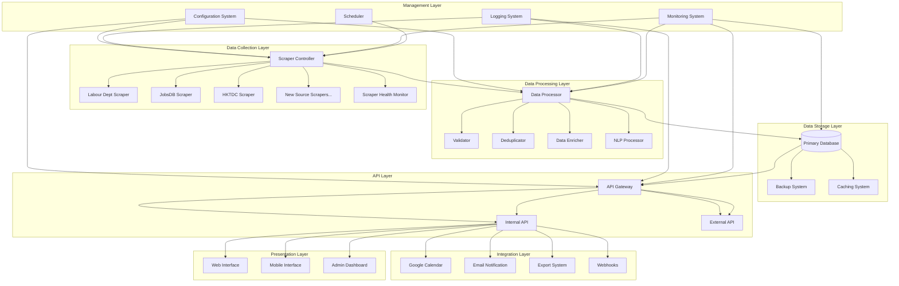
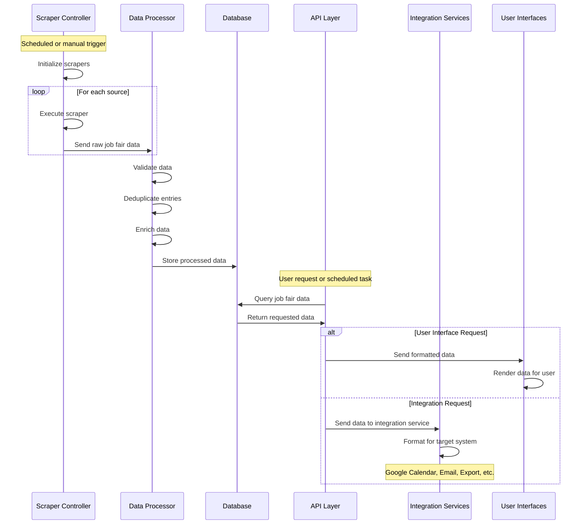
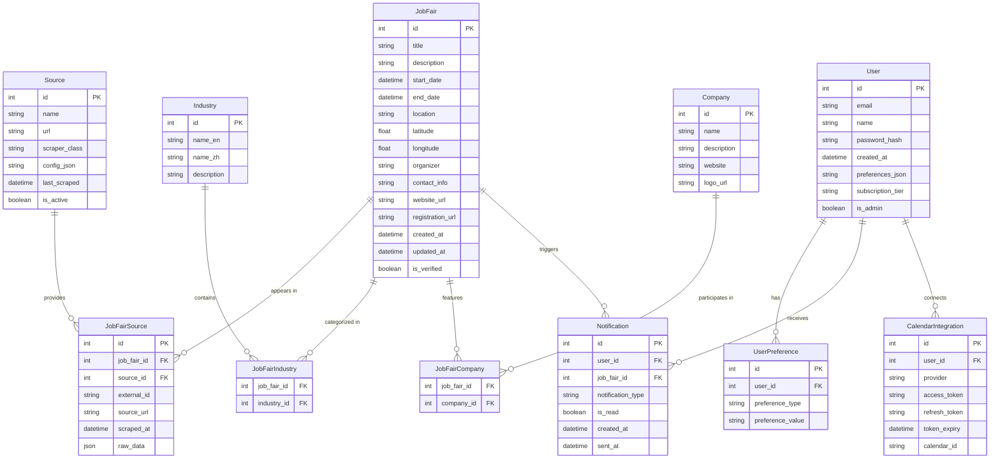
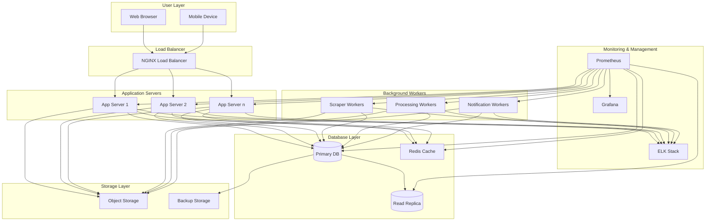

# Hong Kong Job Fair Aggregator - System Design Document

## Table of Contents
1. [Executive Summary](#executive-summary)
2. [Overall System Architecture](#overall-system-architecture)
3. [Component Descriptions and Interactions](#component-descriptions-and-interactions)
4. [Data Flow Diagram](#data-flow-diagram)
5. [Database Schema Design](#database-schema-design)
6. [API and Integration Specifications](#api-and-integration-specifications)
7. [User Interface Design](#user-interface-design)
8. [Deployment Architecture](#deployment-architecture)
9. [Scalability and Commercialization Considerations](#scalability-and-commercialization-considerations)
10. [Implementation Plan](#implementation-plan)
11. [Conclusion](#conclusion)

## Executive Summary

This document outlines the improved system architecture for the Hong Kong Job Fair Aggregator, building upon the existing codebase while addressing missing components and requirements. The system is designed to be modular, scalable, and ready for potential commercialization.

The architecture leverages the existing scraper framework and extends it with robust database integration, data enrichment capabilities, notification systems, and a user-friendly interface in Traditional Chinese (ZH-HK). The design emphasizes maintainability, scalability, and compliance with legal and ethical standards for web scraping.

## Overall System Architecture

The system follows a modular, layered architecture with clear separation of concerns:



## Component Descriptions and Interactions

### Data Collection Layer

1. **Scraper Controller**
   - Orchestrates all scraping operations
   - Manages scraper execution based on schedules
   - Handles scraper failures and retries
   - Provides unified interface for all scrapers

2. **Individual Scrapers**
   - Modular, source-specific implementations
   - Existing: Labour Department, JobsDB, HKTDC
   - To be added: Additional sources from the provided list
   - Each scraper follows a common interface but implements source-specific logic

3. **Scraper Health Monitor**
   - Tracks scraper performance and success rates
   - Alerts on persistent failures
   - Collects metrics on scraping operations

### Data Processing Layer

1. **Data Processor**
   - Coordinates the data processing pipeline
   - Ensures data flows through validation, deduplication, and enrichment

2. **Validator**
   - Validates scraped data against schema
   - Checks for required fields and data types
   - Filters out invalid entries

3. **Deduplicator**
   - Identifies and merges duplicate job fair entries
   - Uses fuzzy matching for similar events
   - Maintains reference to original sources

4. **Data Enricher**
   - Enhances job fair data with additional information
   - Geocoding for locations
   - Company information lookup
   - Industry categorization

5. **NLP Processor**
   - Extracts keywords and entities from descriptions
   - Categorizes job fairs by industry, target audience
   - Supports both English and Traditional Chinese text

### Data Storage Layer

1. **Primary Database**
   - Relational database (PostgreSQL)
   - Stores all job fair data, user preferences, and system metadata
   - Supports full-text search and geographic queries

2. **Backup System**
   - Regular automated backups
   - Point-in-time recovery capability
   - Offsite backup storage

3. **Caching System**
   - Caches frequent queries and API responses
   - Reduces database load
   - Improves response times for users

### API Layer

1. **API Gateway**
   - Single entry point for all API requests
   - Handles authentication and rate limiting
   - Routes requests to appropriate internal services

2. **Internal API**
   - Services for internal components
   - Not exposed to external clients
   - Handles inter-component communication

3. **External API**
   - RESTful API for third-party integration
   - GraphQL API for flexible data querying
   - Documented with OpenAPI/Swagger

### Integration Layer

1. **Google Calendar Integration**
   - Creates and updates calendar events for job fairs
   - Supports user-specific calendar integration
   - Handles calendar permissions and sharing

2. **Email Notification System**
   - Sends alerts for new job fairs matching user criteria
   - Delivers weekly/monthly digests
   - Supports both English and Traditional Chinese

3. **Export System**
   - Generates CSV, Excel, and PDF reports
   - Customizable export templates
   - Scheduled export generation

4. **Webhooks**
   - Allows third-party systems to receive real-time updates
   - Configurable event triggers
   - Secure delivery with retry mechanism

### Presentation Layer

1. **Web Interface**
   - Responsive web application
   - Traditional Chinese (ZH-HK) as primary language
   - English language support
   - Accessible design

2. **Mobile Interface**
   - Progressive Web App (PWA) for mobile access
   - Native-like experience on mobile devices
   - Offline capability for viewing saved job fairs

3. **Admin Dashboard**
   - System monitoring and management
   - Scraper configuration and scheduling
   - User management for commercial version

### Management Layer

1. **Configuration System**
   - Centralized configuration management
   - Environment-specific settings
   - Feature flags for gradual rollout

2. **Logging System**
   - Structured logging across all components
   - Log aggregation and search
   - Audit trail for system operations

3. **Monitoring System**
   - Real-time system health monitoring
   - Performance metrics collection
   - Alerting on system issues

4. **Scheduler**
   - Manages periodic tasks (scraping, reporting, etc.)
   - Distributes load across time
   - Handles dependencies between tasks

## Data Flow Diagram

The following diagram illustrates how data flows through the system:



## Database Schema Design

The database schema is designed to efficiently store job fair data while supporting the system's requirements for search, filtering, and integration.

### Entity-Relationship Diagram



### Table Descriptions

#### Core Tables

1. **JobFair**
   - Central entity storing all job fair information
   - Contains normalized and enriched data
   - Includes geolocation for map-based search

2. **Source**
   - Represents data sources (websites, APIs)
   - Stores scraper configuration
   - Tracks scraping history

3. **JobFairSource**
   - Junction table linking job fairs to their sources
   - Maintains original IDs and URLs
   - Stores raw data for reference

#### Classification Tables

1. **Industry**
   - Industry categories in both English and Chinese
   - Used for filtering and categorization

2. **Company**
   - Information about companies participating in job fairs
   - Can be used for company-specific searches

#### User-Related Tables

1. **User**
   - User account information
   - Subscription tier for commercial version
   - General preferences

2. **UserPreference**
   - Detailed user preferences for notifications
   - Industry, location, and other filtering criteria

3. **Notification**
   - Tracks notifications sent to users
   - Supports different notification types

4. **CalendarIntegration**
   - Stores OAuth tokens for calendar integration
   - Supports multiple calendar providers

## API and Integration Specifications

### Internal API

The internal API facilitates communication between system components:

1. **Scraper API**
   - `POST /api/internal/scraper/run` - Trigger specific scraper
   - `GET /api/internal/scraper/status` - Get scraper status
   - `PUT /api/internal/scraper/config` - Update scraper configuration

2. **Data Processing API**
   - `POST /api/internal/process/validate` - Validate data batch
   - `POST /api/internal/process/deduplicate` - Deduplicate entries
   - `POST /api/internal/process/enrich` - Enrich data with additional info

3. **Notification API**
   - `POST /api/internal/notify/email` - Send email notification
   - `POST /api/internal/notify/calendar` - Create/update calendar event

### External API (RESTful)

The RESTful API provides standard CRUD operations:

1. **Job Fair Endpoints**
   - `GET /api/v1/jobfairs` - List job fairs with filtering
   - `GET /api/v1/jobfairs/{id}` - Get specific job fair details
   - `GET /api/v1/jobfairs/upcoming` - Get upcoming job fairs
   - `GET /api/v1/jobfairs/search` - Search job fairs

2. **User Endpoints**
   - `POST /api/v1/users/register` - Register new user
   - `POST /api/v1/users/login` - User login
   - `GET /api/v1/users/me/preferences` - Get user preferences
   - `PUT /api/v1/users/me/preferences` - Update user preferences

3. **Integration Endpoints**
   - `POST /api/v1/integrations/calendar/connect` - Connect calendar
   - `GET /api/v1/integrations/calendar/events` - List calendar events
   - `POST /api/v1/export/csv` - Export data to CSV
   - `POST /api/v1/export/excel` - Export data to Excel

### GraphQL API

The GraphQL API provides flexible querying capabilities:

```graphql
type Query {
  jobFairs(
    filter: JobFairFilter
    pagination: PaginationInput
    sort: [SortInput]
  ): JobFairConnection
  
  jobFair(id: ID!): JobFair
  
  industries: [Industry]
  
  companies: [Company]
}

type JobFair {
  id: ID!
  title: String!
  description: String
  startDate: DateTime!
  endDate: DateTime!
  location: String!
  coordinates: GeoPoint
  organizer: String
  contactInfo: String
  websiteUrl: String
  registrationUrl: String
  isVerified: Boolean
  industries: [Industry]
  companies: [Company]
  sources: [JobFairSource]
}

# Additional type definitions...
```

### Google Calendar Integration

The system integrates with Google Calendar using the Google Calendar API:

1. **Authentication**
   - OAuth 2.0 for user authorization
   - Secure token storage and refresh

2. **Event Creation**
   - Create events with complete job fair details
   - Include location, description, and links
   - Set appropriate reminders

3. **Event Updates**
   - Update events when job fair details change
   - Maintain synchronization between system and calendar

4. **Calendar Selection**
   - Allow users to select target calendar
   - Support for creating dedicated job fair calendar

### Email Notification System

The email notification system provides timely alerts:

1. **Notification Types**
   - New job fair alerts based on user preferences
   - Weekly/monthly digests
   - Reminder notifications before events

2. **Email Templates**
   - Responsive HTML templates
   - Traditional Chinese and English versions
   - Customizable based on user preferences

3. **Delivery Management**
   - Scheduled delivery windows
   - Retry mechanism for failed deliveries
   - Tracking of open and click rates

## User Interface Design

The user interface is designed with a focus on usability and accessibility, with Traditional Chinese (ZH-HK) as the primary language.

### Web Interface Wireframes

```mermaid
flowchart TB
    subgraph "主頁 (Home Page)"
        H1[標題欄 (Header)]
        H2[搜尋欄 (Search Bar)]
        H3[即將舉行的招聘會 (Upcoming Job Fairs)]
        H4[熱門行業 (Popular Industries)]
        H5[頁腳 (Footer)]
    end

    subgraph "招聘會列表 (Job Fair Listing)"
        L1[篩選選項 (Filter Options)]
        L2[排序選項 (Sort Options)]
        L3[招聘會卡片 (Job Fair Cards)]
        L4[分頁控制 (Pagination)]
    end

    subgraph "招聘會詳情 (Job Fair Details)"
        D1[基本資訊 (Basic Info)]
        D2[地點地圖 (Location Map)]
        D3[參與公司 (Participating Companies)]
        D4[行業類別 (Industry Categories)]
        D5[添加到日曆 (Add to Calendar)]
        D6[分享選項 (Share Options)]
    end

    subgraph "用戶設定 (User Settings)"
        U1[個人資料 (Profile)]
        U2[通知偏好 (Notification Preferences)]
        U3[日曆整合 (Calendar Integration)]
        U4[行業偏好 (Industry Preferences)]
        U5[地區偏好 (Location Preferences)]
    end

    H1 --> H2
    H2 --> H3
    H3 --> H4
    H4 --> H5
    
    L1 --> L2
    L2 --> L3
    L3 --> L4
    
    D1 --> D2
    D2 --> D3
    D3 --> D4
    D4 --> D5
    D5 --> D6
    
    U1 --> U2
    U2 --> U3
    U3 --> U4
    U4 --> U5
```

### Key UI Features

1. **Responsive Design**
   - Mobile-first approach
   - Adapts to different screen sizes
   - Touch-friendly interface

2. **Multilingual Support**
   - Traditional Chinese (ZH-HK) as primary language
   - English language option
   - Language switching without page reload

3. **Search and Filtering**
   - Full-text search across all job fair data
   - Filter by date, location, industry, company
   - Save favorite searches

4. **Interactive Map**
   - Map view of job fair locations
   - Clustering for multiple events in same area
   - Distance-based search

5. **Personalization**
   - User-specific recommendations
   - Saved job fairs
   - Custom notification settings

6. **Accessibility**
   - WCAG 2.1 AA compliance
   - Screen reader compatibility
   - Keyboard navigation support

## Deployment Architecture

The system is designed for cloud deployment with containerization for scalability and portability.



### Deployment Components

1. **Containerization**
   - Docker containers for all components
   - Docker Compose for development
   - Kubernetes for production orchestration

2. **CI/CD Pipeline**
   - Automated testing and deployment
   - GitHub Actions for CI/CD
   - Separate environments (dev, staging, production)

3. **Infrastructure as Code**
   - Terraform for infrastructure provisioning
   - Ansible for configuration management
   - Version-controlled infrastructure

4. **Monitoring and Logging**
   - Prometheus for metrics collection
   - Grafana for visualization
   - ELK Stack for log aggregation and analysis

5. **Backup and Disaster Recovery**
   - Automated database backups
   - Point-in-time recovery
   - Multi-region redundancy for critical components

### Deployment Options

1. **Cloud Provider**
   - Primary: AWS (Amazon Web Services)
   - Alternative: GCP (Google Cloud Platform)
   - Considerations for Hong Kong region availability

2. **Scaling Strategy**
   - Horizontal scaling for application servers
   - Vertical scaling for database (with read replicas)
   - Auto-scaling based on load metrics

3. **Security Measures**
   - HTTPS with TLS 1.3
   - WAF (Web Application Firewall)
   - Regular security audits and penetration testing

## Scalability and Commercialization Considerations

The system is designed with scalability and potential commercialization in mind:

### Multi-Tenant Architecture

1. **Tenant Isolation**
   - Data isolation between tenants
   - Shared infrastructure with logical separation
   - Tenant-specific configurations

2. **Subscription Tiers**
   - Free tier with basic functionality
   - Premium tier with advanced features
   - Enterprise tier with customization options

3. **White-Labeling**
   - Customizable branding for enterprise clients
   - Custom domains and email templates
   - API access for integration with client systems

### Scalability Features

1. **Horizontal Scaling**
   - Stateless application servers
   - Distributed background workers
   - Sharded databases for very large deployments

2. **Performance Optimization**
   - Caching at multiple levels
   - Asynchronous processing for non-critical operations
   - CDN for static assets

3. **Data Growth Management**
   - Data archiving strategy
   - Time-based partitioning
   - Selective replication of hot data

### Commercialization Opportunities

1. **B2B Services**
   - API access for recruitment agencies
   - Embedded widgets for career websites
   - Custom reports and analytics

2. **Premium Features**
   - Advanced analytics and insights
   - Priority notifications
   - Enhanced data enrichment

3. **Data Monetization (with proper consent)**
   - Anonymized trend reports
   - Industry-specific insights
   - Job market analysis

4. **Client Database Building**
   - CRM integration
   - Lead generation tools
   - Client engagement analytics

## Implementation Plan

The implementation is divided into phases with prioritized tasks:

### Phase 1: Foundation (Weeks 1-4)

1. **Database Migration**
   - Design and implement database schema
   - Migrate existing JSON data to database
   - Set up backup and monitoring

2. **Scraper Framework Enhancement**
   - Fix import issues in existing scrapers
   - Implement scraper controller
   - Add error handling and retry logic

3. **Basic API Implementation**
   - Develop core RESTful API endpoints
   - Implement authentication system
   - Create API documentation

4. **Minimal Web Interface**
   - Develop basic web interface in ZH-HK
   - Implement job fair listing and details views
   - Create responsive design foundation

### Phase 2: Core Features (Weeks 5-8)

1. **Data Processing Pipeline**
   - Implement validation system
   - Develop deduplication logic
   - Create basic data enrichment

2. **Google Calendar Integration**
   - Implement OAuth authentication
   - Develop calendar event creation
   - Add synchronization logic

3. **Email Notification System**
   - Set up email delivery infrastructure
   - Create notification templates
   - Implement basic notification rules

4. **User Management**
   - Develop user registration and login
   - Implement preference management
   - Create basic admin interface

### Phase 3: Advanced Features (Weeks 9-12)

1. **Advanced Data Enrichment**
   - Implement NLP for categorization
   - Add geocoding for locations
   - Develop company information lookup

2. **GraphQL API**
   - Design GraphQL schema
   - Implement resolvers and mutations
   - Create GraphQL documentation

3. **Enhanced User Interface**
   - Add interactive map view
   - Implement advanced search and filtering
   - Develop personalization features

4. **Export System**
   - Create CSV and Excel export
   - Implement PDF report generation
   - Develop scheduled export functionality

### Phase 4: Scaling and Commercialization (Weeks 13-16)

1. **Multi-Tenant Architecture**
   - Implement tenant isolation
   - Develop subscription management
   - Create billing integration

2. **Performance Optimization**
   - Implement caching strategy
   - Optimize database queries
   - Add CDN for static assets

3. **Advanced Analytics**
   - Develop analytics dashboard
   - Implement trend analysis
   - Create custom reporting

4. **White-Labeling**
   - Implement customizable branding
   - Add custom domain support
   - Develop client-specific configurations

### Ongoing Tasks

1. **Testing**
   - Unit tests for all components
   - Integration tests for system flows
   - Performance and load testing

2. **Documentation**
   - User documentation in ZH-HK and English
   - Developer documentation
   - API documentation

3. **Legal Compliance**
   - Review and update scraping policies
   - Implement data retention policies
   - Ensure PDPO compliance (Hong Kong Personal Data Privacy Ordinance)

## Conclusion

The proposed system architecture builds upon the existing codebase while addressing all the requirements and adding significant improvements. The design is modular, scalable, and ready for potential commercialization.

Key strengths of the architecture include:

1. **Modularity**: Components are loosely coupled and can be developed, tested, and scaled independently.

2. **Scalability**: The system can handle growing data volumes and user bases through horizontal scaling and efficient data management.

3. **Extensibility**: New data sources, features, and integrations can be added without major architectural changes.

4. **Localization**: The system is designed with Traditional Chinese (ZH-HK) as a primary language, meeting the local market needs.

5. **Commercialization Potential**: The multi-tenant architecture and tiered feature approach support various business models.

By implementing this architecture, the Hong Kong Job Fair Aggregator will provide a comprehensive solution for job seekers and potentially evolve into a commercial platform for recruitment professionals and organizations.
